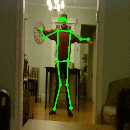

# **Pose Estimation on the Raspberry Pi 4**

Results
=======


Description of Repository
=========================
This repository contains code and instructions to configure the necessary software for running pose estimation on the Raspberry Pi 4!

Details of Software and Neural Network Model for Object Detection:
* Language: Python
* Framework: TensorFlow Lite
* Network: PoseNet with MobileNet-V1


The motivation for the Project
========================
The goal of this project was to how well pose estimation could perform on the Raspberry Pi.
Google provides code to run pose estimation on Android and IOS devices - but I wanted to write
python code to interface with and test the model on the Pi.

Additional Resources
===================
* **YouTube Turorial For This Repository**: https://youtu.be/RUp-K4NEllg
* **Blog Pose on Posenet**: https://medium.com/tensorflow/real-time-human-pose-estimation-in-the-browser-with-tensorflow-js-7dd0bc881cd5
* **Pose estimation with TensorFlow Lite**:https://www.tensorflow.org/lite/models/pose_estimation/overview

Testing Configuration
=============================

Core
* Raspberry Pi 4 GB
* Raspberry Pi 5MP Camera (rev 1.3)

Other
* LED 
* 470 Ohm Resistor
* Small breadboard 
* GPIO push button
* 3.5 Amp USB-C Power Supply

Setting Up Software
====================
1.) Clone Repository:
```
git clone https://github.com/ecd1012/rpi_pose_estimation.git
````
2.) Change directory to source code:
```
cd rpi_pose_estimation
```
3.) Please see my other post here: https://github.com/ecd1012/rpi_road_object_detection
And follow **Setting Up Software** Steps: 3-9 before proceeding
Here is a video of those steps: https://youtu.be/Zfmo3bMycUg

4.)At this point, you should have all the dependencies installed and your virtual environment activated.

5.) Grab the sample TensorFlow Lite Posenet model from Google
```
wget https://storage.googleapis.com/download.tensorflow.org/models/tflite/posenet_mobilenet_v1_100_257x257_multi_kpt_stripped.tflite
```

Setting Up Hardware
===================
6.) Please see my other post here: https://github.com/ecd1012/rpi_road_object_detection
And follow **Setting Up Hardware** Steps: 10-12 before proceeding
Here is a video of those steps: https://youtu.be/Zfmo3bMycUg

Running Pose Estimation
=================
7.) After all your hardware and software is configured correctly run the following command:
```
python3 TFLite_pose.py --modeldir notebooks/posenet_mobilenet_v1_100_257x257_multi_kpt_stripped.tflite --output_path pose_images
```
Where the --output_path you specify is where you want images saved.

8.) The script will start running and wait for you to press the GPIO input button to start processing the video feed from the camera. 
Once you press the button, the green LED will turn on and the pi will start feeding and processing the video stream through the neural network.
Processed images will be saved to the '--output_path' you specified over the command line, with a timestamped folder for each button press.

9.) If you like, make a video out of the images.
You can do this with gif making software, video making software, or ffmpeg.
Help: https://stackoverflow.com/questions/24961127/how-to-create-a-video-from-images-with-ffmpeg
Or by using gif maker software: https://ezgif.com/


